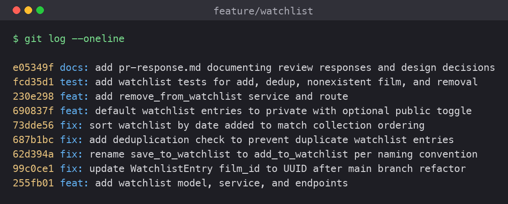

# PR Response Doc — CineLog Watchlist Feature

This document records my responses to @dev-lead's six review comments on the
watchlist PR, the two design decisions I was asked to make, and how to test the
feature.

## AI Usage

I used an AI assistant (Claude) at several points, all in the supporting roles
the project sanctions — orientation, pattern-matching against existing code,
mechanical edits, and stress-testing my reasoning. Specifically:

- **Orientation:** I had it summarize `models.py`, `services/collection_service.py`,
  and `tests/test_collection.py` so I understood the `verb_to_noun` naming, the
  `add_to_collection()` dedup pattern (film-existence check → existing-entry check
  → `UniqueConstraint`), and the fixture layout in the tests before I touched the
  watchlist code. I verified every summary against the actual source.
- **Pattern application:** For the dedup logic (Comment 2), the removal function
  (stretch), and the test file (Comment 3), I mirrored the collection equivalents
  rather than inventing new shapes.
- **Stress-testing the design decisions (Comments 4 and 5):** After I chose my
  positions, I asked the AI to argue the *opposite* side — "what would a careful
  reviewer say against private-by-default? against date-added sorting?" It played devils advocate and the
  counterarguments it raised (discovery friction for a community app; alphabetical
  being easier to scan in a long list) are exactly the tradeoffs I acknowledge
  below. I kept my positions but added the explicit tradeoff paragraphs in
  response.
- **Hygiene:** I had it check my `git log --oneline` against the Conventional
  Commits spec and confirm each message maps to one logical change.

The design *decisions* themselves (visibility default, sort order) are mine — the
AI was used to pressure-test them, not to make them.

---

## Comment 1 — Rename `save_to_watchlist()` → `add_to_watchlist()`

**What I did:** Renamed the function in `services/watchlist_service.py` and updated
its one call site in `routes/watchlist/watchlist.py` (both the `import` line and
the call inside `add_film`).

**How I verified:** The project convention is `verb_to_noun`
(`add_to_collection`, `remove_from_collection`, `get_collection`), so `add_` is
the correct verb — matching the collection service exactly. I ran a project-wide
search (`grep -rn "save_to_watchlist" --include="*.py" .`) after the change and it
returned zero matches, confirming no stale references remain. The full test suite
still passes.

---

## Comment 2 — Deduplication

**What I did:** Added a deduplication check to `add_to_watchlist()`, following the
`add_to_collection()` pattern exactly:

1. Film-existence check (already present) raising `FilmNotFoundError`.
2. A new existing-entry check — query `WatchlistEntry` by `(user_id, film_id)`;
   if one exists, raise a new `AlreadyInWatchlistError`.
3. A DB-level `UniqueConstraint("user_id", "film_id", name="unique_user_film_watchlist")`
   on the model as a backstop, mirroring `unique_user_film_collection`.

I also brought the route in line with the collection route, which the watchlist
route was missing entirely: `add_film` now wraps the service call in try/except
and maps `FilmNotFoundError` → 404 and `AlreadyInWatchlistError` → 409 (previously
those exceptions would have surfaced as an unhandled 500).

**How I verified:** I read `add_to_collection()` to confirm what it returns on a
duplicate (it *raises* `AlreadyInCollectionError` rather than silently no-op'ing),
and copied that contract. `test_add_to_watchlist_duplicate_raises` asserts the
exception is raised *and* that only one row exists afterward. End-to-end, a second
`POST /add` for the same film returns HTTP 409.

---

## Comment 3 — Missing test

**What I did:** Created `tests/test_watchlist.py`, reusing the `app`, `sample_user`,
and `sample_film` fixtures from `tests/test_collection.py`. The required test,
`test_add_to_watchlist_nonexistent_film_raises`, is the direct equivalent of
`test_add_to_collection_nonexistent_film_raises`: it passes a UUID that isn't in
the DB and asserts `FilmNotFoundError` is raised (not a DB integrity error).

**How I verified:** I modeled the test on the exact structure of the collection
test — same fixture parameters, same `with app.app_context()`, same
`pytest.raises`. `pytest tests/test_watchlist.py -v` passes, and the full suite
(`pytest tests/ -v`) is green at 11 passed.

---

## Comment 4 — Default visibility (design decision)

**My position:** New watchlist entries should default to **private**
(`public=False`).

**Reasoning:** The biggest reason for me is that this choice only goes cleanly in
one direction. If the default is private, anyone can flip a specific entry to
public whenever they want and nothing is lost. But if the default is public, you
can't really undo it — by the time someone switches an entry back to private, it
may already have been seen, so the disclosure has already happened. You can make
private public, but you can't really make public private. Defaulting to private
keeps that decision in the user's hands and makes the reversible option the
default one.

It also fits what a watchlist actually is. A collection is stuff I've already
watched and chose to log — I've kind of already put that out there. A watchlist is
just "maybe I'll watch this," and that's more personal. I'm a fairly private,
introverted person and I keep my own watchlist to myself, so defaulting it to
public isn't how I'd want it to behave. It's also telling that in CineLog the
`public` flag exists on the watchlist but *not* the collection — the schema itself
treats watchlist visibility as the thing that needs a deliberate choice.

**Tradeoff acknowledged:** CineLog is a community app, so private-by-default does
cost it something — public watchlists are good social signal, and if everything
starts private the community side is thinner until people opt in. I don't think
that outweighs the privacy point above, and I'd rather earn public sharing through
an easy, obvious opt-in than take it as a default. That's exactly why I added the
`public` parameter to `add_to_watchlist()` and the `/add` endpoint: sharing is one
flag away for anyone who wants it, but it stays the user's call, not the app's.

**Implementation note:** I set the model default to `public=False` so the code
matches this decision, and exposed the `public` parameter through the service and
endpoint (see stretch section) for callers who want to share explicitly.

---

## Comment 5 — Sort order (design decision)

**My position:** Switch `get_watchlist()` from alphabetical (`Film.title.asc()`) to
**date-added, newest first** (`WatchlistEntry.date_added.desc()`) — i.e., the
maintainer's preference.

**Engagement with the reviewer's point:** When I open my watchlist I want the
newest stuff on top — I don't want to hunt down a title through an alphabetical
list. The films I added most recently are usually the ones I actually care about
watching next, and a lot of the time they're what everyone's currently talking
about. Recency is a much better signal for "what do I want to watch right now"
than the first letter of a title, which tells me nothing useful. The maintainer
argued for date-added on consistency, and I agree with that too — `get_collection()`
already sorts `CollectionEntry.date_added.desc()`, so making the watchlist match
means the two main lists behave the same way instead of following different rules
for no reason a user would understand. But the main reason for me is behavioral:
a watchlist is a queue of what to watch next, and newest-first is how I actually
use it.

**Tradeoff acknowledged:** Alphabetical does win in one case — when you're trying
to find one specific title you already know is on the list, a stable A–Z order is
easier to scan, especially once the list is long. And the honest downside of
newest-first is that on a big list, old entries sink to the bottom and can get
forgotten. I don't think that outweighs the everyday case, though: for a list
you're actively adding to, newest-first surfaces what's relevant. If the "buried
old entries" problem became real, I'd solve it with a sort/filter option later,
not by defaulting the whole list to alphabetical.

**Implementation note:** Changed the `order_by` in `get_watchlist()` and dropped
the now-unnecessary `.join(Film)` (the join only existed to sort by title). The
`entry.film` lookup in the loop still works via the `WatchlistEntry.film`
relationship. `test_get_watchlist_returns_newest_first` locks in the behavior.

---

## Comment 6 — Rebase on updated main

**What conflicted:** While this PR was open, `refactor: migrate film IDs from
integer to UUID` merged to `main`, changing `Film.id` and `CollectionEntry.film_id`
from `Integer` to `String(36)`. This branch was based on the pre-refactor commit.

The subtle part: `git rebase origin/main` completed *without printing conflict
markers*, but it did not leave a working tree. Git kept `main`'s UUID versions of
`Film`/`CollectionEntry` and, in doing so, dropped my appended `WatchlistEntry`
class from `models.py` entirely — the app then failed to start with
`ImportError: cannot import name 'WatchlistEntry' from 'models'`. And had the class
survived, `WatchlistEntry.film_id` was still declared `db.Integer`, an integer
foreign key pointing at a now-UUID (`String(36)`) primary key. So the "conflict"
was semantic, not textual: a green rebase that produced a broken model.

**How I resolved it:** I re-added `WatchlistEntry` to `models.py` and declared
`film_id = db.Column(db.String(36), db.ForeignKey("film.id"))` to match the
refactored `Film.id`. I also updated the stale `film_id (int)` references in the
service and route docstrings to `(str) UUID`. The branch is rebased directly onto
`origin/main` with a linear history — no merge commits.

**How I verified no conflict remains:** `git status` is clean and
`git log --oneline origin/main..HEAD` shows a linear series of my commits with no
merge commit. The app imports and starts, `pytest tests/ -v` is green (11 passed),
and I exercised every endpoint against a UUID `film_id` end-to-end (see manual
testing steps below). `git log --merges origin/main..HEAD` returns nothing.

---

## Stretch features

- **`remove_from_watchlist(user_id, film_id)`** — implemented following the
  `remove_from_collection` pattern: raises a new `NotInWatchlistError` when the film
  isn't on the list, otherwise deletes the entry and returns `True`. Exposed via
  `DELETE /watchlist/<user_id>/remove`. Tested by
  `test_remove_from_watchlist_removes_entry` and
  `test_remove_from_watchlist_nonexistent_raises`.
- **A second test of my choosing** — `test_add_to_watchlist_defaults_to_private`.
  I chose this edge case because it's the one that directly protects the Comment 4
  design decision: a future refactor that flips the default back to public would be
  caught by a failing test, not discovered as a privacy regression in production.
  It also asserts the explicit `public=True` override still works.
- **Visibility toggle** — added a `public` parameter to `add_to_watchlist()`
  (default `False`) and threaded it through the `/add` endpoint
  (`data.get("public", False)`), so callers can set visibility explicitly instead
  of relying on the default.

---

## Commit History

Rewritten into Conventional Commits (`feat:` / `fix:` / `test:` / `docs:`), one
logical change per commit, linear on top of `origin/main` with no merge commits:

```
feat: add watchlist model, service, and endpoints
fix:  update WatchlistEntry film_id to UUID after main branch refactor
fix:  rename save_to_watchlist to add_to_watchlist per naming convention
fix:  add deduplication check to prevent duplicate watchlist entries
fix:  sort watchlist by date added to match collection ordering
feat: default watchlist entries to private with optional public toggle
feat: add remove_from_watchlist service and route
test: add watchlist tests for add, dedup, nonexistent film, and removal
docs: add pr-response.md documenting review responses and design decisions
```



*(The screenshot above shows the actual `git log --oneline` output with commit
hashes. The docs commit's own short hash shifts by one line when this image is
folded into that commit — for a pixel-exact copy, run `git log --oneline` and
re-screenshot after pushing.)*

---

## PR Description

**What the feature does:** Adds a personal *watchlist* — films a user wants to
watch later — alongside the existing collection (films already watched). Users can
save a film to their watchlist, view it, and remove films. Each entry has a
visibility flag so a user can choose to share individual watchlist items with the
CineLog community.

Endpoints (registered under `/watchlist`):
- `GET  /watchlist/<user_id>` — return the user's watchlist, newest first.
- `POST /watchlist/<user_id>/add` — body `{ "film_id": "<uuid>", "public": false }`
  (`public` optional, defaults to `false`).
- `DELETE /watchlist/<user_id>/remove` — body `{ "film_id": "<uuid>" }`.

**Design decisions made:**
1. **Visibility default = private (`public=False`).** Watchlist intent is
   aspirational and can be revealing; users opt in to sharing rather than opting
   out. A `public` parameter lets callers set visibility explicitly. (Comment 4.)
2. **Sort order = date added, newest first.** Consistent with `get_collection()`
   and matches how a "to-watch" queue is actually used. (Comment 5.)

**How to test it manually:**

```bash
# 1. Set up and run the app
python -m venv .venv && source .venv/bin/activate
pip install -r requirements.txt
python app.py        # serves http://127.0.0.1:5000 (no frontend; use curl)

# 2. In another shell, create a user and a film via a quick Python REPL
python - <<'PY'
from app import create_app, db
from models import User, Film
app = create_app()
with app.app_context():
    u = User(username="demo", email="demo@example.com")
    f = Film(title="Dune", year=2021)
    db.session.add_all([u, f]); db.session.commit()
    print("USER_ID =", u.id)
    print("FILM_ID =", f.id)
PY
# Copy the printed USER_ID and FILM_ID into the calls below.

# 3. Add a film (private by default) — expect 201 with "public": false
curl -s -X POST http://127.0.0.1:5000/watchlist/<USER_ID>/add \
  -H "Content-Type: application/json" -d '{"film_id":"<FILM_ID>"}'

# 4. Add the same film again — expect 409 (deduplication)
curl -s -o /dev/null -w "%{http_code}\n" -X POST \
  http://127.0.0.1:5000/watchlist/<USER_ID>/add \
  -H "Content-Type: application/json" -d '{"film_id":"<FILM_ID>"}'

# 5. Add a nonexistent film — expect 404
curl -s -o /dev/null -w "%{http_code}\n" -X POST \
  http://127.0.0.1:5000/watchlist/<USER_ID>/add \
  -H "Content-Type: application/json" \
  -d '{"film_id":"00000000-0000-0000-0000-000000000000"}'

# 6. Add a second film explicitly public — expect "public": true
curl -s -X POST http://127.0.0.1:5000/watchlist/<USER_ID>/add \
  -H "Content-Type: application/json" \
  -d '{"film_id":"<FILM_ID_2>","public":true}'

# 7. View the watchlist — expect newest-first order
curl -s http://127.0.0.1:5000/watchlist/<USER_ID>

# 8. Remove a film — expect 200, then confirm it's gone in step 7
curl -s -X DELETE http://127.0.0.1:5000/watchlist/<USER_ID>/remove \
  -H "Content-Type: application/json" -d '{"film_id":"<FILM_ID>"}'
```

Or run the automated suite: `pytest tests/ -v` (11 passed).
